## atencao · Todo número agora nasce dentro de um circuito
Acabou o "sem circuito". Ao criar uma faixa de DIDs, escolher o circuito passou a ser obrigatório,
e mudar de circuito em massa também exige dizer para qual. Os cartões do topo agora mostram
**DIDs livres** no lugar de "DIDs sem circuito".
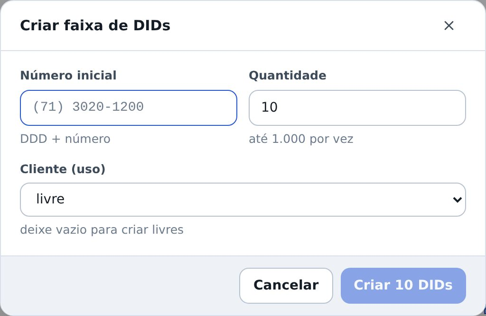

## atencao · Cada número diz se está em uso ou só alocado
Alocar não é usar: quando um número vai para um cliente, ele entra como **não usado** — alguém
marca **em uso** quando ele passa a atender de verdade. Basta clicar na marca para trocar.
Liberar o número, ou passá-lo para outro cliente, derruba a marca. Na Numeração dá para ver só os
que estão em uso, só os que ainda não estão, ou marcar vários de uma vez pela barra de seleção.

## novo · Rede padrão e login dos aparelhos, por modelo
Na aba **Acessos** do cliente: IP, máscara, roteador padrão, DNS e a senha do ramal sem fio — o que
a equipe digita no telefone na hora de configurar. Abaixo, o **login e a senha padrão de cada
modelo**: todos os GXP1610 daquele cliente usam um; os DP722, outro. A senha fica no cofre.
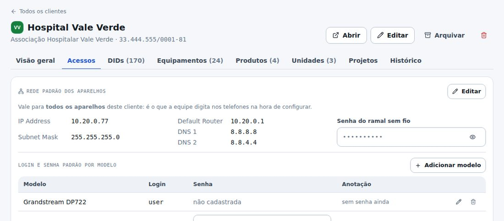

## novo · Tronco por IP ou por login e senha
No cadastro do circuito você escolhe como o tronco se autentica na operadora. Por **IP**: o IP da
operadora e o IP do PBX. Por **login e senha**: o login do tronco e a senha, guardada no cofre.
O que não pertence ao tipo escolhido some do formulário.

## novo · Unidades com endereço e IP fixo de saída
Cada unidade do cliente (Matriz, filial, loja) agora guarda o endereço e o IP fixo de saída da
rede dela — o IP que chega ao servidor quando os ramais daquela unidade registram.
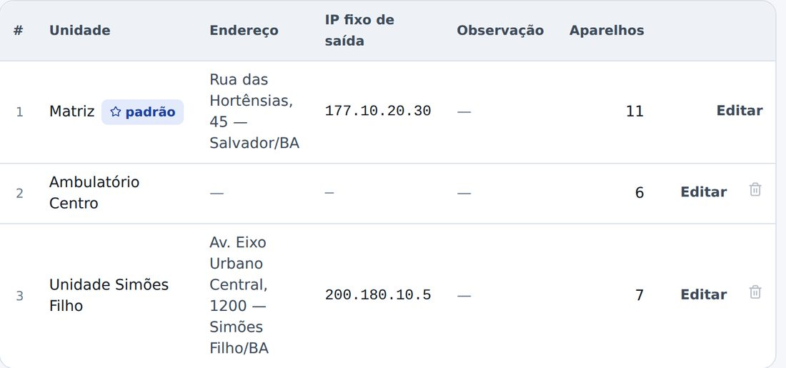

## melhorou · Movimentar colando a lista de MACs
No "Movimentar aparelhos", o botão **Colar lista de MACs / N/S** aceita a lista inteira de uma vez.
O que existe no estoque entra na seleção; o que não existe aparece listado, sem barrar o resto.

## melhorou · Movimentações por modelo e por aparelho
O histórico de movimentações ganhou filtro por **modelo** e busca por **MAC ou N/S** — dá para
ver a vida inteira de um aparelho, na ordem em que ela aconteceu.

## melhorou · Renomear item de catálogo
Operadora, hospedagem e categoria de aparelho agora podem ser renomeadas pelo lápis ao lado do
nome, em Administração › Catálogos. O nome novo vale em todo lugar que usa o item.
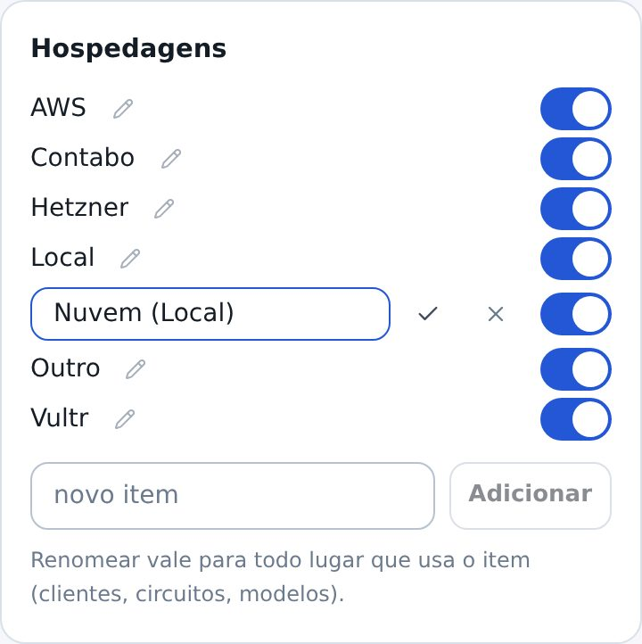

## melhorou · A lista de clientes vem inteira
Sem páginas: todos os clientes de uma vez, como você pediu.

## novo · Projetos: a mesma tarefa acompanhada em vários clientes
Quando um trabalho não é de um cliente e sim de uma lista deles — trocar o áudio da URA de todo
mundo com PBX, por exemplo —, ele vira um **projeto**. Você diz o objetivo, o prazo e as **etapas**;
escolhe os clientes (dá para pegar todos de um produto de uma vez) e a equipe vai marcando.

## novo · O andamento é contado, não digitado
Cada cliente é uma linha, cada etapa é uma coluna. A situação anda sozinha: marcou a primeira
etapa, entra em **andamento**; marcou todas, vira **concluído**. Ninguém precisa dizer "está em 40%".
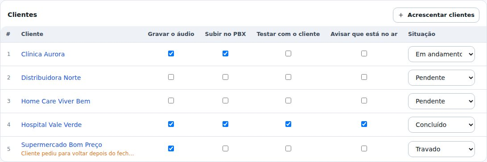

## atencao · Travado só existe com o motivo escrito
Cliente parado vira **travado**, e o sistema pede o porquê ("pediram para voltar depois do
fechamento"). O motivo aparece na linha e no painel — é o que se cobra na reunião. Tem também
**não se aplica**, para o cliente que entrou na lista mas não precisa: fecha a linha sem contar
como trabalho feito.
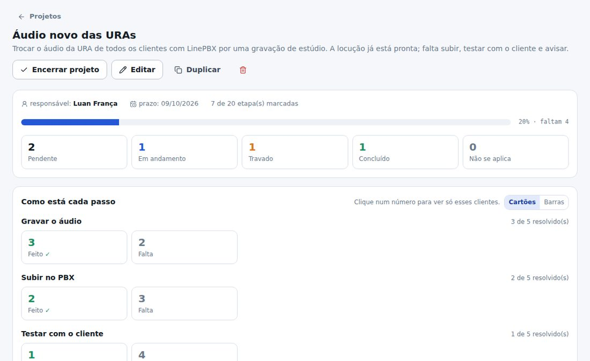

## novo · Coluna em lista de opções, como na planilha
A etapa pode ser uma **caixinha** (feito ou não) ou uma **lista de opções** coloridas — Sem
necessidade · Pendente envio · Mensagem enviada · Cliente confirmou. Você escolhe o rótulo, a cor e
quais opções **resolvem** a etapa; só essas contam no andamento.
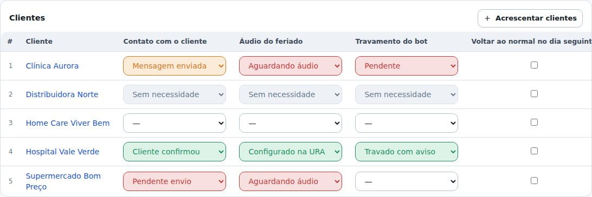

## novo · Você monta as opções de cada coluna
Ao criar ou editar o projeto, escolha se a etapa é caixinha ou lista. Na lista, escreva as opções,
dê a cor de cada uma e marque as que **resolvem** — o sistema não deixa salvar uma lista que nunca
fecharia.
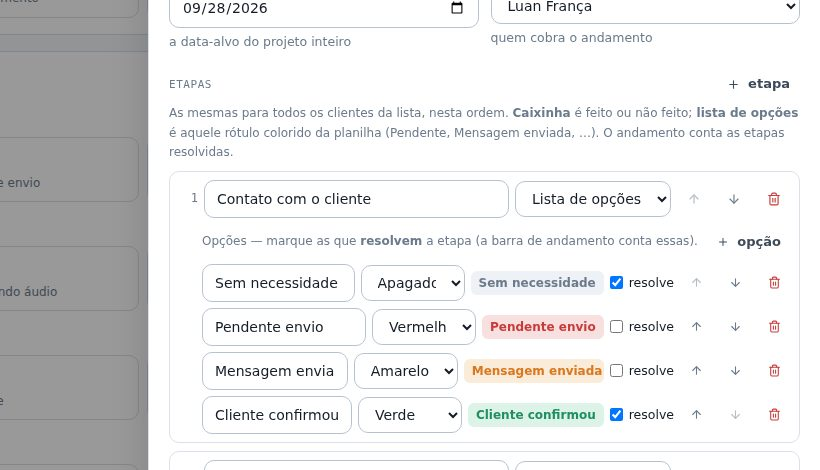

## novo · O painel de cada passo
"Quantos já confirmaram? Quantos ainda estão aguardando áudio?" — a resposta fica no topo do
projeto, passo a passo. Clicar num número mostra só aqueles clientes. Dá para ver em cartões ou em
barras, como preferir.
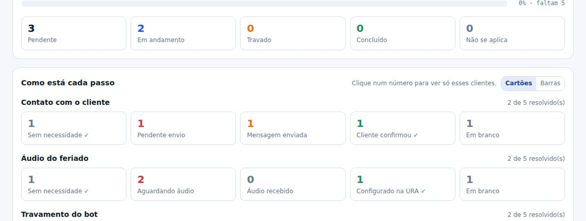

## novo · Comentários e anexos, no projeto e em cada cliente
O roteiro da locução fica no projeto; o "liguei duas vezes, ficaram de retornar" fica no cliente.
Anexo aceita **qualquer formato** — planilha, documento, print, o próprio MP3 da URA — até 10 MB.
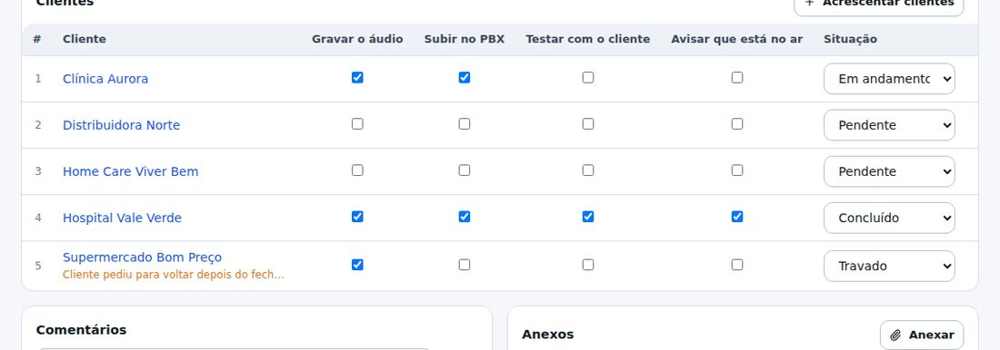

## novo · Duplicar projeto
Feriado se repete. O botão **Duplicar** cria outro projeto com as mesmas etapas, as mesmas opções e
a mesma lista de clientes, tudo zerado e sem prazo.

## novo · A ficha do cliente mostra os projetos dele
Aba **Projetos**: de quais ele participa, em que situação está em cada um e quantas etapas já foram.
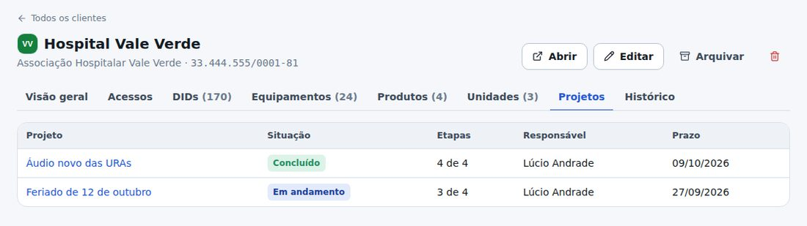

## atencao · Duas permissões novas, e quem já usa o sistema não perde nada
**Trabalhar nos projetos** (marcar etapas, comentar, anexar) já foi para Operador, Técnico e
Administrador. **Gerenciar projetos** (criar, definir etapas e a lista) ficou só com o Administrador.
O Leitor enxerga tudo e não mexe em nada, como no resto do sistema. As duas estão na tela de Papéis
para remanejar quando quiser.

## novo · Os primeiros gráficos
No Painel, **quem está com mais valor nosso na mão** (locação e comodato; venda não conta). No
Inventário, o **parque por modelo**: verde é o que está em estoque, azul o que está com clientes, e
clicar numa parte já filtra a lista. Na ficha do cliente, a mesma leitura por modelo.
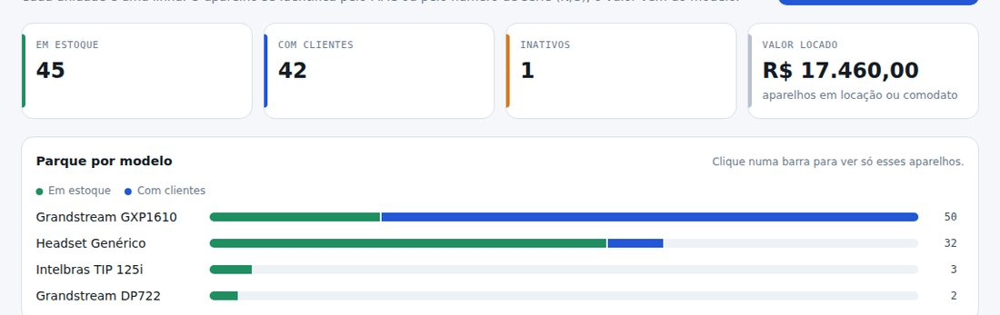

## novo · Estas novidades ficam guardadas aqui
Toda publicação passa a ter um **patch** como este. Ele abre no seu login e é leitura
obrigatória: passe por todos os cartões e marque "Li e entendi" para voltar ao sistema. No menu
**Novidades** cada patch fica numa pasta — abra a pasta para reler o que mudou naquele dia.
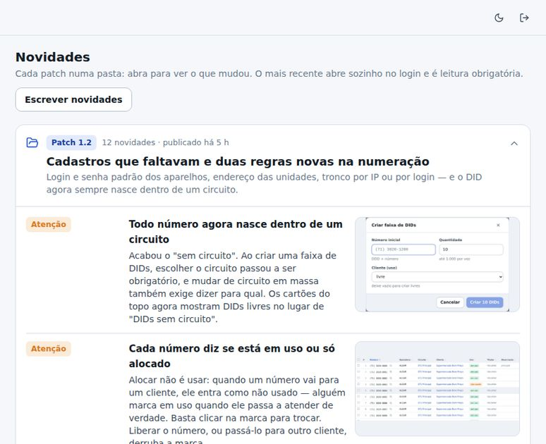

## corrigido · A anotação do tronco não se preenche mais sozinha
A palavra "address" que às vezes aparecia sozinha na anotação do circuito era o preenchimento
automático do navegador, não o sistema. Os campos foram marcados para o navegador não chutar.
