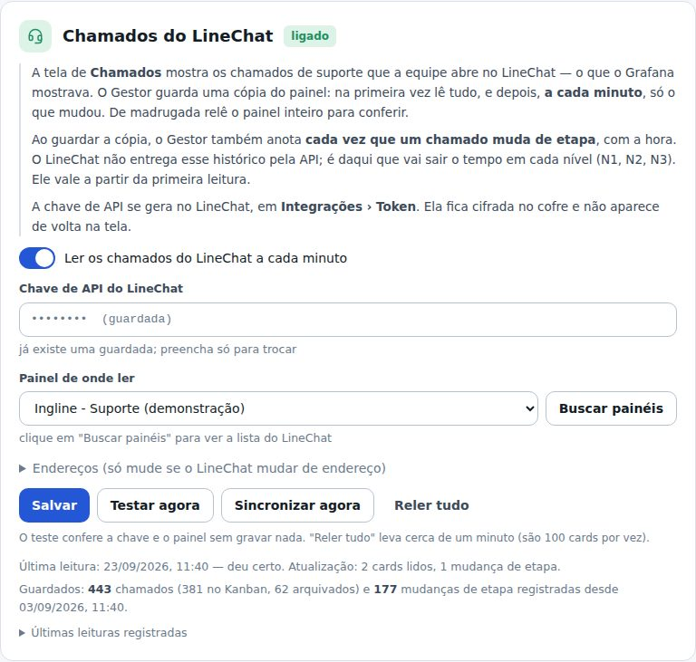
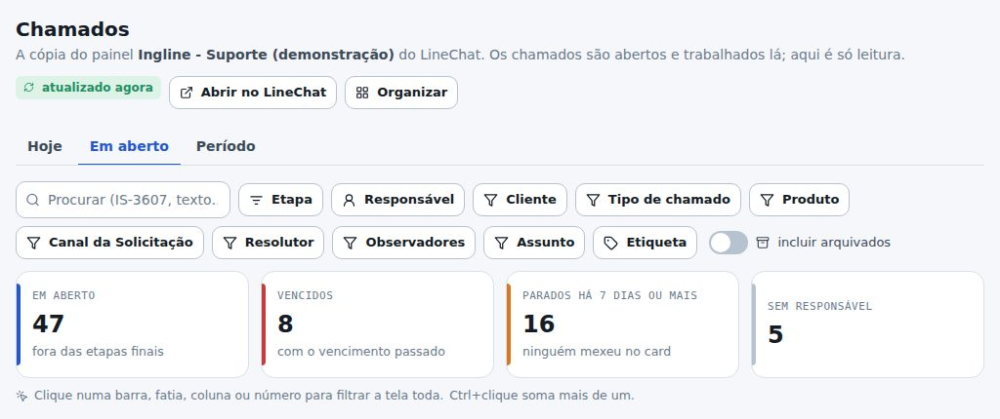
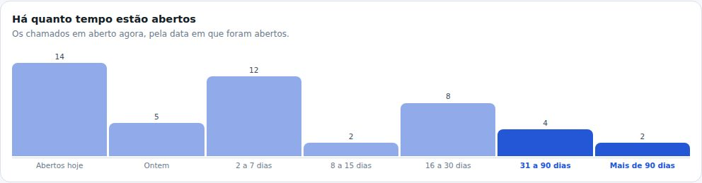
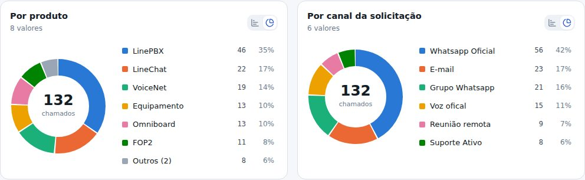
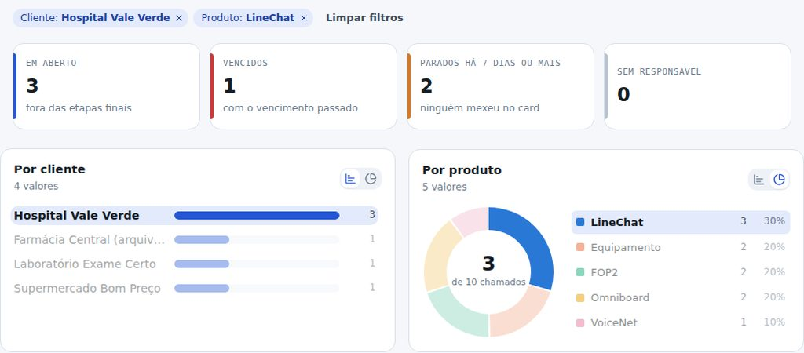
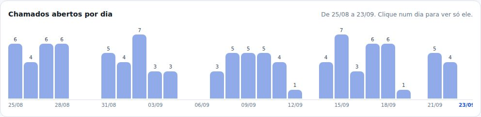
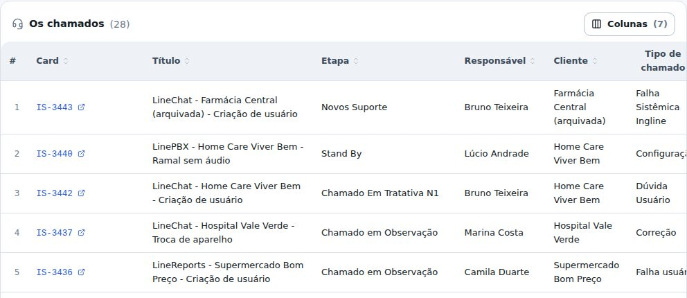

## atencao · Para começar: ligar a leitura do LineChat
Em Administração › Ajustes há um cartão novo, Chamados do LineChat. Cole a chave de API do
LineChat, clique em Buscar painéis, escolha o Ingline - Suporte, salve e clique em Sincronizar
agora. A primeira leitura traz todos os chamados (uns 3 mil, leva cerca de um minuto); depois o
Gestor busca sozinho, a cada minuto, só o que mudou.

## novo · Chamados: o Grafana agora mora no Gestor
Menu Chamados, com três abas: Hoje (o que chegou hoje), Em aberto (o que está na mesa agora) e
Período (um intervalo escolhido). Os chamados continuam sendo abertos e trabalhados no LineChat —
aqui é só leitura. Conferido com os dados de agosto: os mesmos 318 chamados e as mesmas contas por
cliente, tipo, canal e produto que o Grafana mostrava.

## novo · Há quanto tempo cada chamado está aberto
Na aba Em aberto, o gráfico separa os chamados pela idade: abertos hoje, ontem, de 2 a 7 dias, até
mais de 90 dias. Os números de cima mostram os vencidos, os parados há 7 dias ou mais (ninguém
mexeu no card) e os sem responsável.

## novo · Pizza ou barras, você escolhe
Cada gráfico tem, no canto, dois botões: barras ou pizza. Produto, Tipo de chamado e Canal já abrem
em pizza, como no Grafana. A pizza mostra as 6 maiores fatias, cada uma com nome, número e %; o
resto vai para Outros, que abre a lista do que foi somado. A escolha fica guardada no seu navegador.

## melhorou · Clicou na barra, a tela inteira filtra
Clicar em qualquer barra ou fatia (um cliente, um produto, uma etapa, um responsável) filtra a tela
toda por ela. Os filtros aparecem escritos logo abaixo, cada um com o seu X, e os números obedecem a
eles. Também dá para filtrar pelos botões, procurar pelo código do card ou por uma palavra, e
incluir os arquivados (o Grafana não contava).

## novo · Chamados por dia, no período que você quiser
Na aba Período, escolha as datas ou use os atalhos: 7 dias, 30 dias, este mês, mês passado,
12 meses. Clicar num dia mostra só aquele dia. Períodos longos passam a somar por mês.

## novo · A lista de chamados abre o card no LineChat
Embaixo, a tabela com todos os chamados do recorte: clique no código (IS-3607) e o card abre no
LineChat. As colunas se escolhem no botão Colunas — cada campo do card vira uma coluna.

## novo · A hora de cada mudança de etapa fica guardada
O LineChat não entrega o histórico do card pela API. O Gestor passa a anotar sozinho cada vez que
um chamado muda de etapa, com a hora. Isso vale a partir da primeira leitura e é o que vai permitir
medir quanto tempo cada chamado fica em N1, N2 e N3.
