## atencao · A aba Em aberto virou o interruptor "só em aberto"
Os Chamados agora têm duas abas, Hoje e Período, e ao lado dos filtros o interruptor só em aberto,
que vale nas duas. Para ver tudo o que está na mesa, de qualquer data, use o Período com o atalho
Tudo e o interruptor ligado — ou clique em Em aberto agora, na aba Hoje, que leva direto para lá.
Os números de cima mudam junto: em aberto, vencidos, parados há 7 dias ou mais e sem responsável.
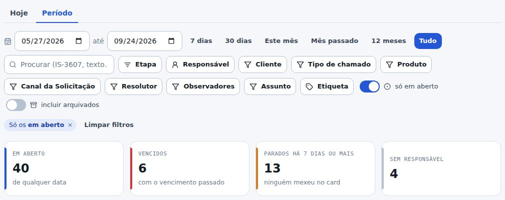

## atencao · Os gráficos abrem em pizza
Todos os gráficos de lista dos Chamados agora abrem em pizza. Quem preferir barras clica no botão
do canto (fica guardado no seu navegador), e a administração pode deixar barras para a equipe toda
em Organizar.
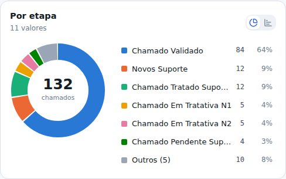

## novo · Grupos: várias opções num ponto só
Em Organizar, cada gráfico tem o botão Grupos. Um grupo junta várias opções: por exemplo, Ramal
junta Ramal - Configuração, Ramal - Criação e Ramal - Telefone Sem Serviço. O botão Sugerir pelo
começo do nome monta os grupos óbvios de uma vez. No gráfico, o botão Agrupar junta e separa; clicar
no grupo filtra por todas as opções dele. No filtro do campo, as opções aparecem separadas por grupo.
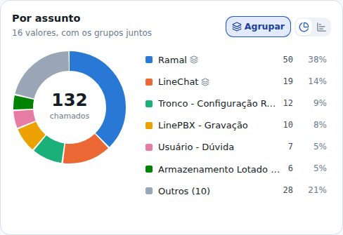

## novo · A equipe escolhe as etapas que fecham o chamado
Em Organizar, o botão Etapas que fecham diz quais colunas do Kanban contam como fechadas. O padrão
continua sendo o do LineChat (Chamado Tratado Suporte e Chamado Validado). O que for marcado sai do
só em aberto e passa a contar em Fechados, na hora em que o chamado chegou na etapa.
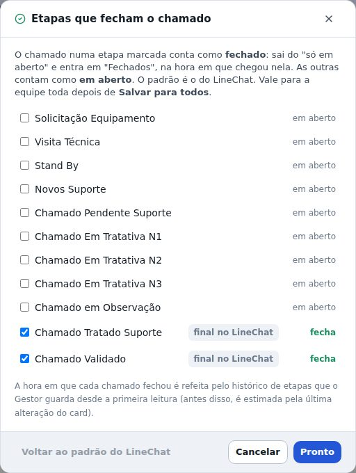

## melhorou · Abrir o Outros mostra cada um no seu lugar
Na pizza, clicar em Outros desdobra a lista: cada opção que estava ali vira um item normal, com a sua
fatia e o seu número. As cores continuam só nas 6 maiores; o resto fica em cinza. Juntar os menores
em Outros, no fim da lista, volta ao jeito curto.
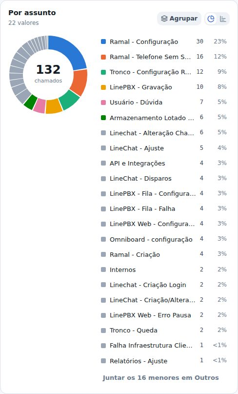

## corrigido · A descrição do chamado aparece na tabela
A tabela de chamados ganhou a coluna Descrição, com o começo do texto do card (o texto inteiro
aparece ao passar o mouse, e o card abre no LineChat pelo código). Ela já vem marcada; dá para
tirar no botão Colunas.
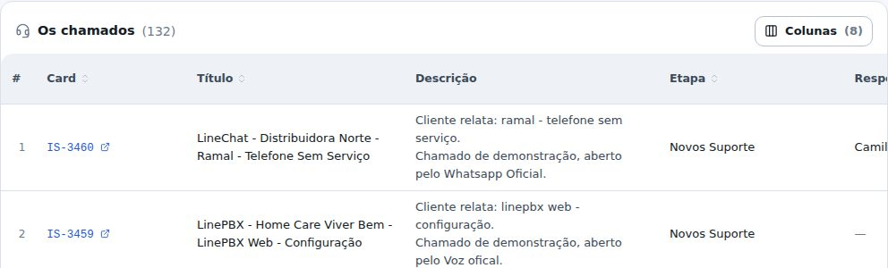

## novo · DIDs do cliente: procurar e filtrar
Na ficha do cliente, a aba DIDs ganhou a busca (pelo número, com ou sem DDD, ou por um pedaço da
observação) e o interruptor só não usados, com a quantidade ao lado. Quando o cliente tem mais de
uma operadora, circuito ou titular, aparece o filtro de cada um. Em cima, quantos números estão à
vista de quantos o cliente tem.
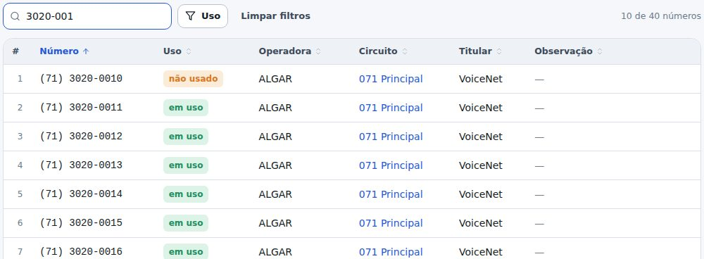

## novo · A observação do DID se edita na própria linha
Clique na observação de um número, na aba DIDs do cliente: o campo abre ali mesmo. Enter grava, Esc
desiste, e deixar vazio limpa. Quem pode alocar números pode editar.
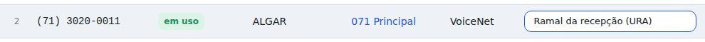

## novo · Projetos: escolher clientes cruzando produtos e módulos
Na janela Escolher clientes, os produtos e os módulos aparecem todos à vista, na cor de cada um e
com quantos clientes têm. Clique em mais de um para cruzar: VoiceNet e Equipamentos mostra só quem
tem os dois (ou troque para tem qualquer um). Os módulos entram do mesmo jeito, como LinePBX › FOP2,
e cada cliente da lista mostra o que tem.
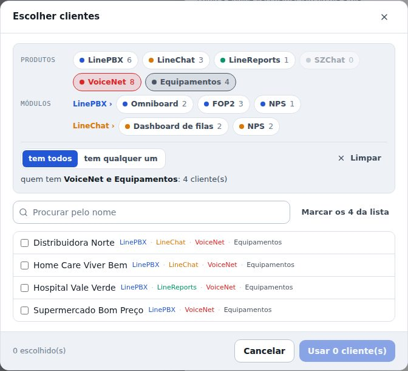

## melhorou · Mais cores nas opções dos projetos
As opções das etapas de lista ganharam Turquesa, Amarelo, Rosa e Roxo. O antigo Amarelo passou a se
chamar Laranja, que é a cor que ele sempre teve — nada do que já estava escolhido mudou de cor.
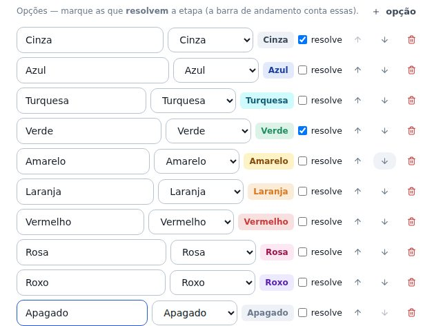

## melhorou · FOP2: a senha do ramal admin
No FOP2 (na ficha do cliente, Produtos › LinePBX › FOP2), a senha agora é a do ramal admin, e ela
aparece na aba Acessos logo abaixo do ramal. A senha do usuário padrão saiu da tela; as que já
estavam cadastradas continuam guardadas no cofre.
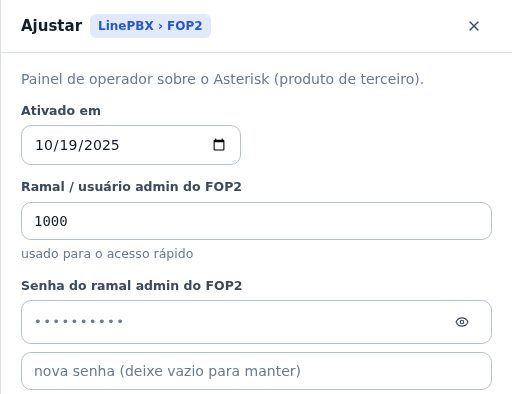

## corrigido · Omniboard e SZChat agora gravam login e senha
O e-mail do administrador e as senhas do Omniboard e do SZChat não estavam sendo gravados, embora a
tela dissesse que tinha salvo. Agora gravam. Se você cadastrou algum antes deste patch, cadastre de
novo.

## corrigido · Sem barrinha de rolagem à toa
As faixas de abas (Chamados, ficha do cliente, Inventário, Administração e as outras) tinham uma
barrinha de rolagem sem motivo no canto direito. Sumiu. No celular, Importar / Exportar e
Administração › Produtos também pararam de arrastar a tela para o lado.
