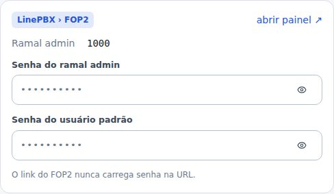
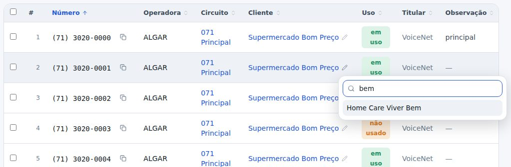
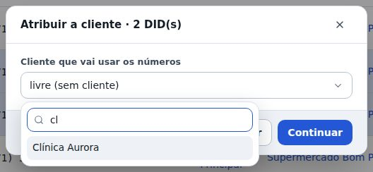
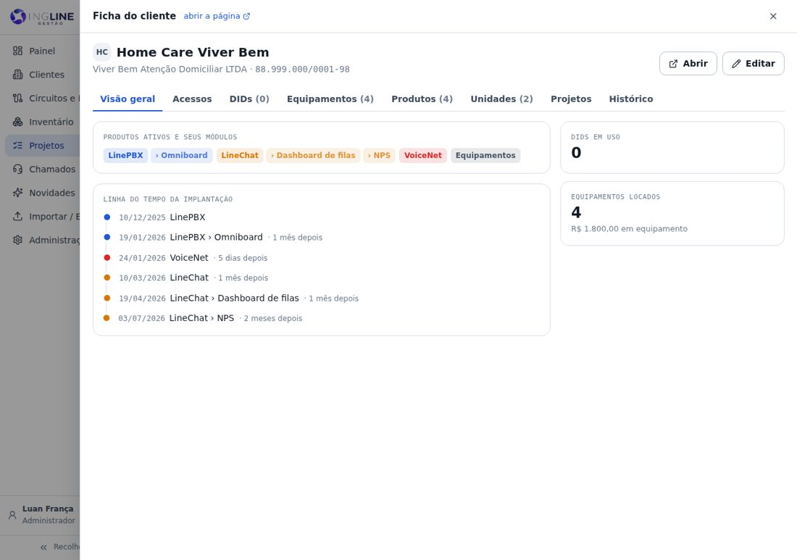
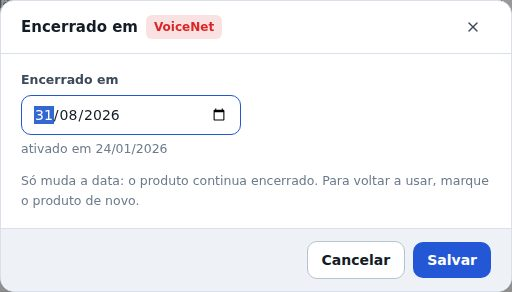
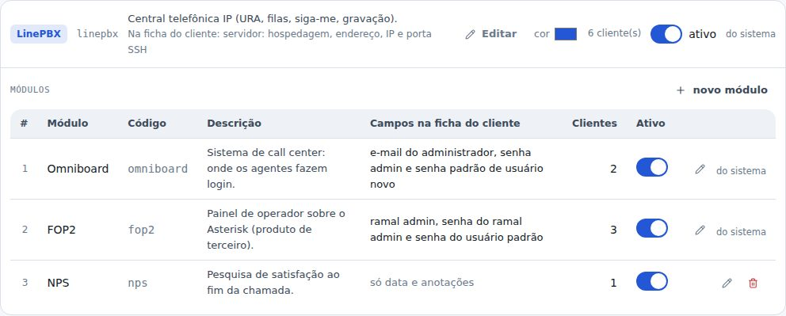
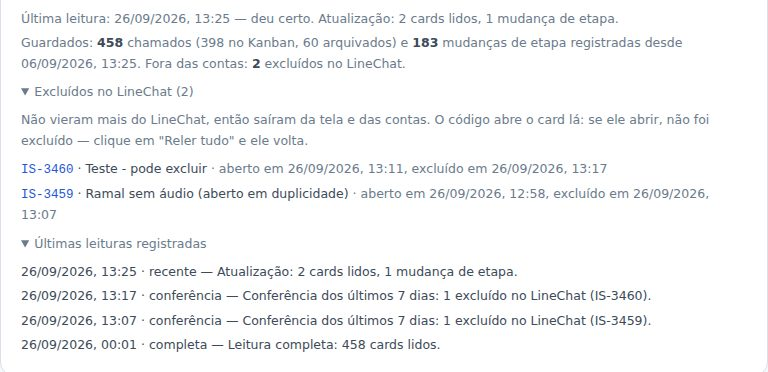

## atencao · FOP2: a senha do usuário padrão voltou
O FOP2 guarda de novo as duas senhas: a do ramal admin e a do usuário padrão. As senhas do usuário
padrão que foram cadastradas antes do 1.4 nunca foram apagadas: elas voltam a aparecer sozinhas, na
aba Acessos e em Produtos › FOP2 › Ajustar.

## novo · DIDs: cliente, uso e observação na própria linha
Em Circuitos › Numeração, na ficha do circuito e na ficha do cliente, cada número se ajusta ali
mesmo. O lápis ao lado do cliente troca o cliente, ou libera o número. Clicar em "em uso" alterna a
marca. Clicar na observação abre o campo: Enter grava, Esc desiste. Trocar o cliente faz o número
entrar como não usado no cliente novo.

## melhorou · Escolher o cliente digitando
As listas de clientes viraram uma caixa com busca: digite um pedaço do nome, sem se preocupar com
acento, e escolha com o mouse ou com as setas e o Enter. Vale no filtro da Numeração, em Atribuir
a cliente, na faixa nova de DIDs, no titular do circuito, no Inventário e ao movimentar aparelhos.

## melhorou · O cliente do projeto abre em janela
Num projeto, clicar no nome do cliente abre a ficha dele por cima do projeto, com todas as abas.
Fechar (no X ou no Esc) volta para o projeto no mesmo lugar. Para ir à ficha de verdade, use o
"abrir a página" no alto da janela.

## novo · Corrigir a data de desativação
Produto encerrado e módulo desativado ganharam um lápis ao lado da data: dá para acertar o dia em
que isso aconteceu de verdade, sem reativar nada. A data não pode ser antes da ativação nem no
futuro.

## novo · Módulos: editar e mandar para a lixeira
Em Administração › Produtos, cada módulo tem o lápis, para trocar o nome e a descrição, e a
lixeira. O módulo excluído some das fichas e dos filtros, e dá para restaurar em Lixeira, com as
ligações dos clientes de volta. FOP2 e Omniboard são do sistema e não vão para a lixeira. A coluna
"Config. própria" virou "Campos na ficha do cliente" e diz quais são, e a nova coluna Clientes
mostra quantos usam cada módulo.

## melhorou · Card excluído no LineChat sai em até 10 minutos
Antes, o card excluído no LineChat continuava nos Chamados até as 4h do dia seguinte: excluir não
conta como mudança para a leitura de minuto em minuto. Agora, a cada 10 minutos, o Gestor confere os
chamados abertos na última semana e tira da tela e das contas o que foi excluído lá.

## melhorou · O painel inteiro é conferido à meia-noite
A releitura do painel inteiro passou das 4h para a meia-noite. Ela pega os excluídos com mais de uma
semana, e o dia fecha com os números certos. Para conferir na hora, continua existindo o Reler tudo.

## novo · Ajustes mostra quais cards saíram
Em Administração › Ajustes › Chamados do LineChat, a lista Excluídos no LineChat mostra cada card
que saiu das contas, com o código que abre o card lá. Se ele abrir, não foi excluído: clique em
Reler tudo e ele volta. Nada é apagado do Gestor.

## melhorou · Equipamentos sem data de ativação
O produto Equipamentos não pede mais o Ativado em: a data que importa é a de cada aparelho, nas
movimentações. Ele também saiu da linha do tempo da implantação e da coluna de data da lista de
clientes.

## corrigido · Sem barrinha de rolagem nas abas
No Chrome do Windows, uma barrinha vertical ainda aparecia na ponta das abas (Administração,
Circuitos e DIDs e as outras). Agora a faixa de abas não desenha barra em navegador nenhum. No
celular, ela continua rolando para o lado com o dedo.
