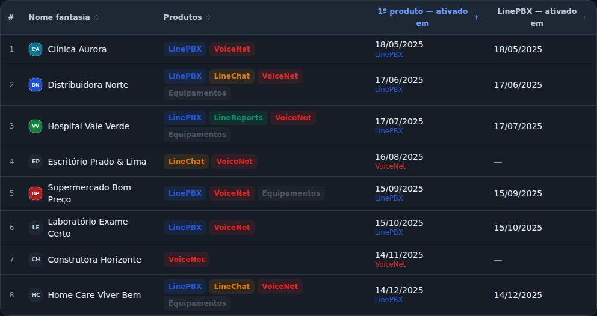

## corrigido · Clientes: "1º produto — ativado em"
Em Clientes, no modo tabela, o botão Colunas tem no grupo Ativado em a coluna do 1º produto: a data
de ativação do produto ativado primeiro, mesmo que o cliente tenha vários, com o nome do produto
embaixo. Contam os produtos ativos hoje; o Equipamentos não entra, porque não tem data de ativação.
Clicar no título ordena por ela. Quem tinha marcado a coluna "1º módulo" do 1.6 já vê a nova no
lugar dela.

