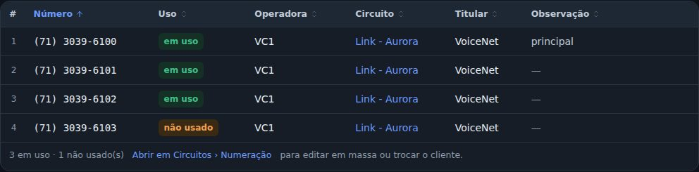
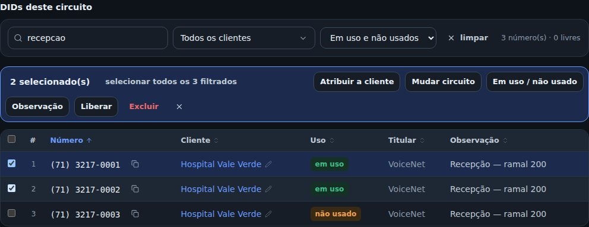
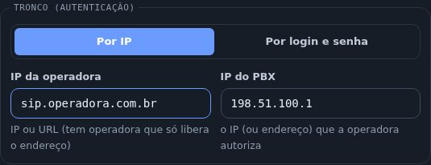
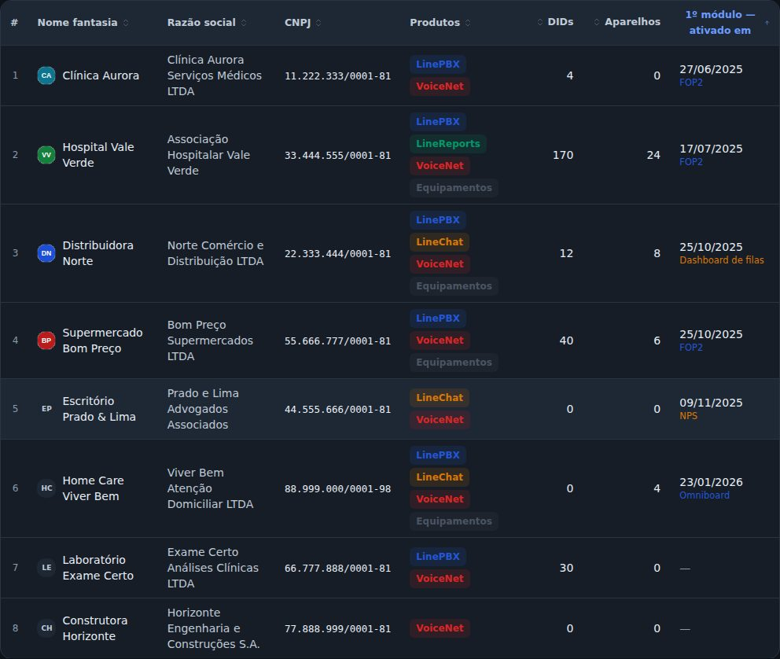

## atencao · Ficha do cliente: o "trocar cliente" saiu dos DIDs
Na aba DIDs da ficha do cliente continuam a busca, os filtros, a marca de uso e a observação na
própria linha. Para passar um número para outro cliente, ou liberar, use Circuitos › Numeração ou a
ficha do circuito: lá a coluna Cliente tem o lápis.

## novo · DIDs do circuito com busca, filtros e edição em massa
Na ficha do circuito, os DIDs são a mesma tabela da Numeração, só com os números daquele circuito.
Procure pelo número ou por um pedaço da observação, filtre por cliente e por uso, marque as caixas
e use a barra que aparece: atribuir a cliente, mudar circuito, em uso ou não usado, observação,
liberar e excluir. Os dados do tronco passaram para uma faixa no alto, e a tabela ganhou a largura
toda.

## melhorou · A busca da Numeração também acha a observação
Em Circuitos › Numeração, a busca aceita o número (com ou sem DDD e traço) ou um pedaço da
observação, sem se preocupar com acento nem maiúscula. O "selecionar todos os filtrados" pega
exatamente os mesmos números.

## novo · IP ou URL da operadora
No cadastro do circuito, o campo IP da operadora aceita o endereço, para as operadoras que só
liberam a URL (por exemplo, sip.operadora.com.br). Digitando só números, os pontos do IP continuam
entrando sozinhos. O IP do PBX aceita endereço também.

## novo · Clientes: coluna "1º módulo — ativado em"
Em Clientes, no modo tabela, o botão Colunas tem no grupo Ativado em a coluna do 1º módulo: a data
de ativação do módulo ativado primeiro, mesmo que o cliente tenha vários, com o nome do módulo
embaixo. Contam os módulos ligados hoje. Clicar no título ordena por ela.

