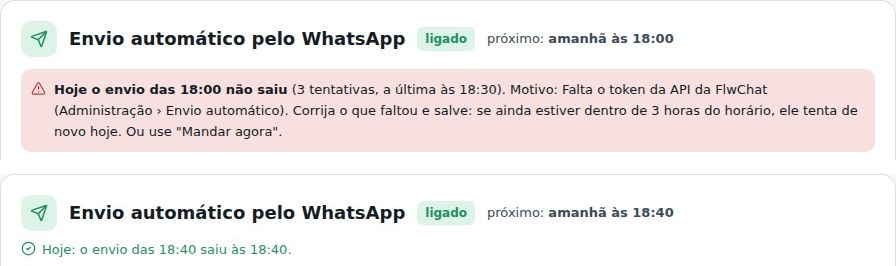

## corrigido · Trocar o horário vale já para hoje
Em Administração › Envio automático, trocar o horário agora vale já para o dia de hoje. Antes, se o
envio do dia já tinha saído ou falhado 3 vezes no horário antigo, o novo horário só valia a partir de
amanhã ("próximo: amanhã às…"), e o envio do horário não chegava.

## corrigido · Salvar depois de uma falha dá 3 tentativas novas
Se o envio do horário falhou (faltava o token, o número estava desconectado na FlwChat…), corrija e
salve: ele ganha 3 tentativas novas no mesmo dia, se ainda estiver dentro das 3 horas depois do
horário. Um envio que deu certo não sai de novo só porque alguém salvou.

## novo · Como foi o envio de hoje
Ao lado de "próximo", a tela diz como foi o envio de hoje. Pode ter saído (e a que horas), pode ter
falhado e ter hora marcada para tentar de novo, ou pode não ter saído. O motivo sempre aparece. O
"próximo" também mostra a nova tentativa ("hoje às 18:15 (nova tentativa)"). A tela se atualiza
sozinha a cada minuto, sem apagar o que você está digitando.

## corrigido · Um envio demorado não sai duas vezes
Se montar o PDF e mandar demorar mais de um minuto, a conferência do minuto seguinte espera em vez de
mandar de novo.
