## novo · Chamados › Relatórios
Em Chamados, ao lado de Hoje e Período, a aba Relatórios. São vinte relatórios em cinco abas —
Tempo, Volume, Clientes, Equipe e Mês — e mais a aba Favoritos, a primeira. O período e os filtros (etapa, responsável, cliente, produto, assunto,
etiqueta) são os mesmos da tela de Chamados e vão junto quando você troca de aba. Clique em
qualquer número, faixa, degrau ou quadrado para ver os chamados por trás dele, cada um com o link
para o card no LineChat.
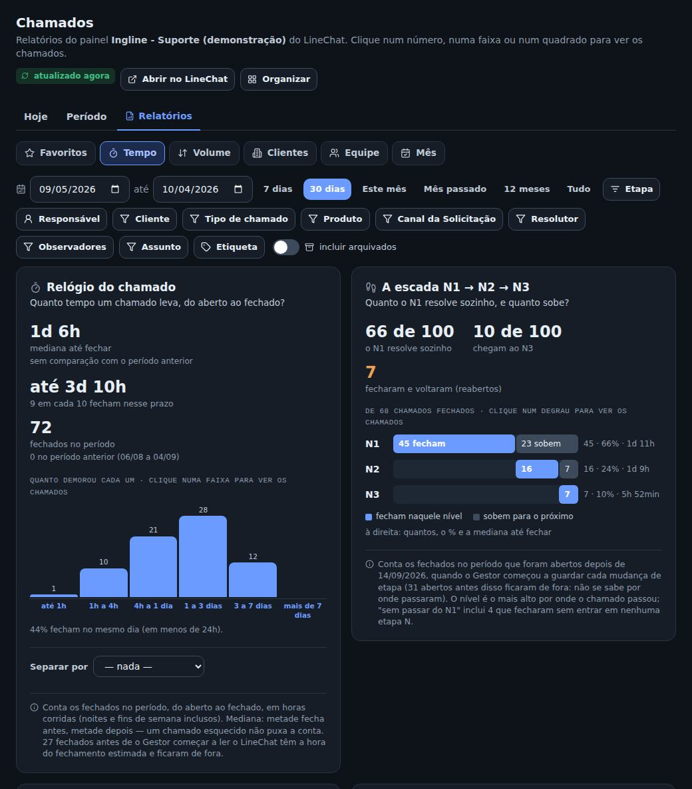

## novo · Organizar: a ordem, esconder e os Favoritos (quem administra)
O botão Organizar, em cima da página, abre a lista de cada aba: as setas mudam a ordem, "Esconder"
tira da página o que a equipe não usa e a estrela põe na aba Favoritos — a primeira, que abre
sozinha quando tem algum. Na aba Favoritos, as setas mudam a ordem dos favoritos. Nada vale antes
do "Salvar para todos": aí a equipe toda vê a página assim, e a mudança fica na auditoria.
Escondido não some de vez: aparece um aviso no pé da aba, e "Mostrar" traz de volta.
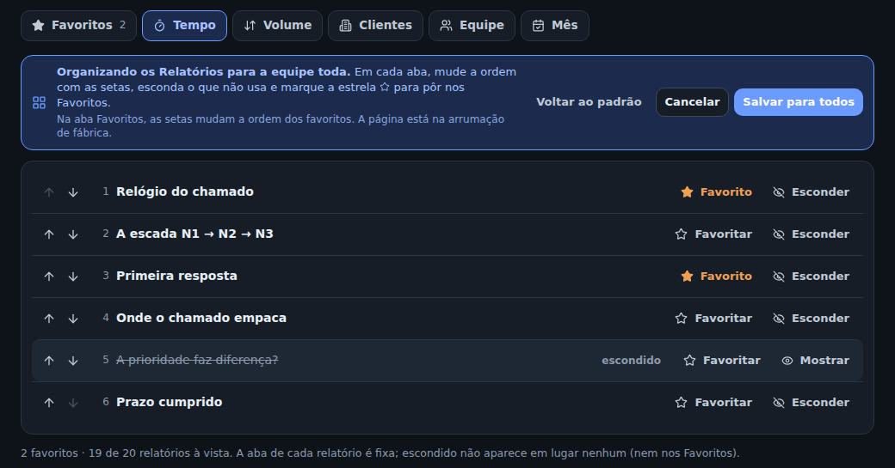

## novo · Relógio do chamado e a escada N1 → N2 → N3
O Relógio mostra quanto tempo os chamados levam do aberto ao fechado: a mediana, o "9 em cada 10
fecham em até…" e as faixas (até 1h, 1h a 4h, até 1 dia…). Em "Separar por" dá para comparar o
tempo de cada tipo, produto, responsável, cliente ou assunto. A escada mostra, de cada 100 chamados
fechados, quantos o N1 resolveu sozinho, quantos subiram ao N2 e ao N3, e quantos fecharam e
voltaram. Ela usa o caminho de cada chamado pelas etapas, que o Gestor guarda desde a primeira
leitura do LineChat.

## novo · Onde o chamado empaca
Quanto tempo o chamado fica em cada etapa do Kanban, a mediana e o "9 em 10 até", com a etapa mais
lenta em destaque e quantos estão parados em cada uma agora. Mostra se o gargalo é o N2, o
"Pendente Suporte" ou a fila de entrada.
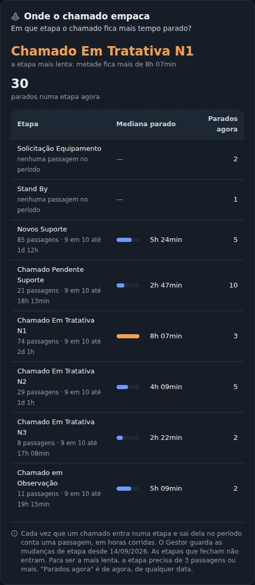

## novo · Primeira resposta
Quanto tempo o chamado espera em Novos Suporte até alguém pegar, contando os que chegam no horário
comercial (os que chegam à noite e no fim de semana ficam à parte). Mostra quantos foram pegos em até
1 hora, quantos estão esperando agora e o que espera há mais tempo, com o link do card.
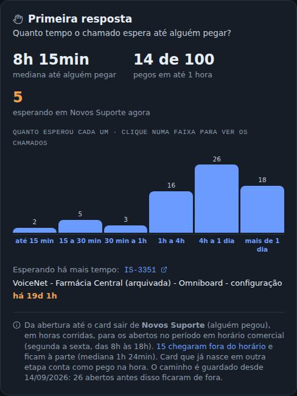

## novo · A prioridade faz diferença?
Pelas etiquetas P/ Crítica, P/ Alta, P/ Média e P/ Baixa: quantos fecharam, a mediana até fechar e
quantos estão em aberto de cada uma. Se uma prioridade mais alta demorou mais que uma mais baixa, o
número de cima avisa ("Nem sempre"). Mostra também quantos fecham sem prioridade.
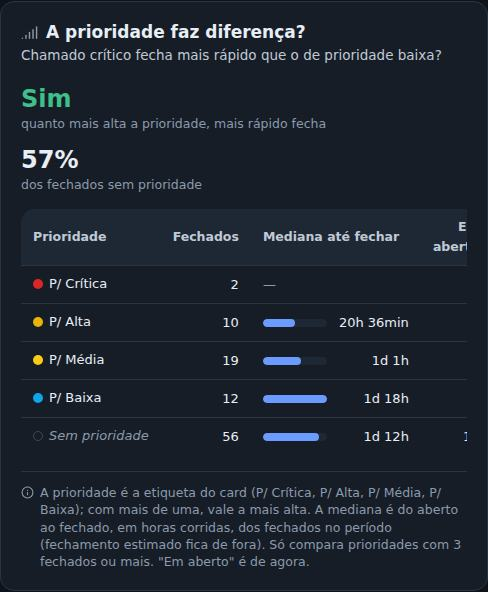

## novo · Prazo cumprido
Dos chamados com vencimento no LineChat, quantos fecharam até o dia do vencimento, quantos
depois, e os vencidos em aberto agora — e o mesmo por tipo de chamado.
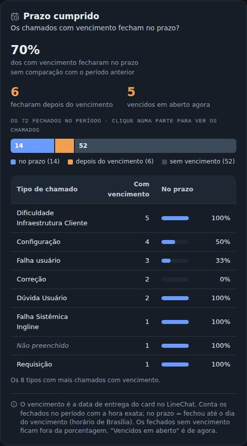

## novo · Mapa de calor da semana
Em que dia da semana e hora os chamados chegam, com o horário de pico e quantos chegam fora do
horário comercial. Ajuda a montar a escala.
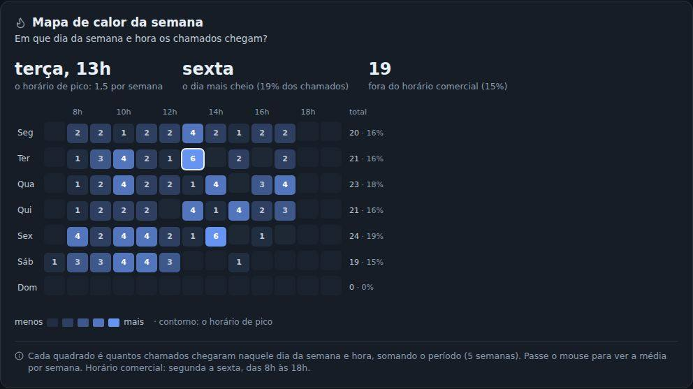

## novo · Entrada × saída
Semana a semana, quantos chegaram, quantos fecharam e o tamanho da fila no fim de cada uma. Se chega
mais do que sai por várias semanas, o número de cima avisa.
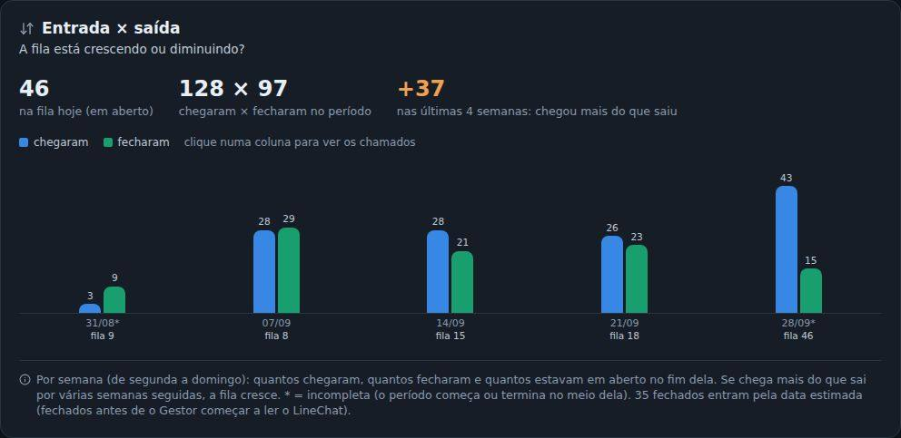

## novo · Idade da fila
Os chamados em aberto agora, por há quanto tempo foram abertos (até 1 dia, 1 a 3, 3 a 7, 7 a 15, 15
a 30, mais de 30 dias), e separados por etapa. A partir de 7 dias fica em laranja. Mostra também o
mais antigo, com o link do card.
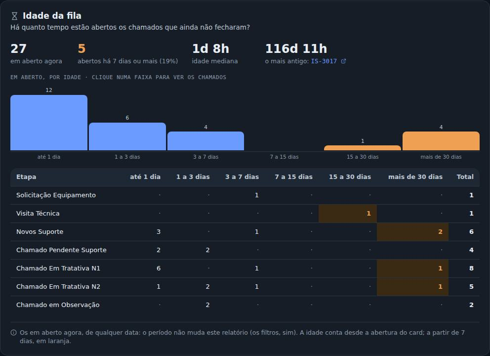

## novo · Dias fora da curva
Os dias com muito mais chamado que o normal para aquele dia da semana, com o assunto que dominou e o
cliente que mais abriu. Uma queda de operadora ou uma atualização que deu problema aparece aqui
sozinha.
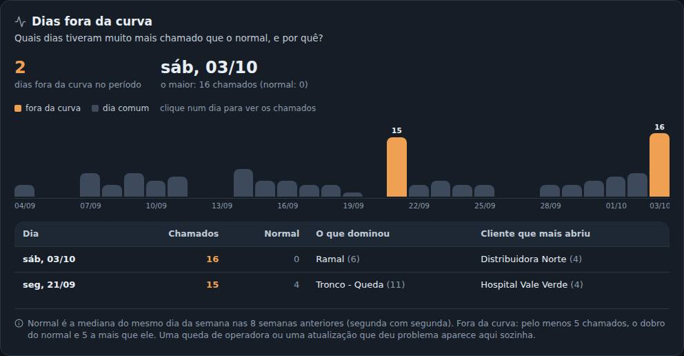

## novo · Sobe e desce dos assuntos
Os assuntos que mais subiram e mais caíram em relação ao período anterior do mesmo tamanho (com os
30 dias de padrão, os 30 dias antes deles). Vem com os grupos do Assunto juntos (Ramal, LineChat…);
o botão "juntar pelos grupos" separa. Clique num assunto para ver os chamados.
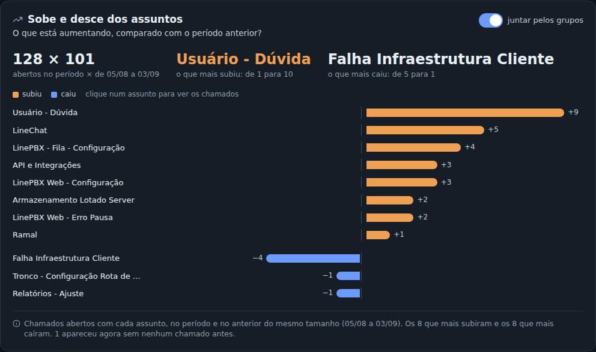

## novo · Os poucos que pesam muito
O 80/20 dos chamados: do maior para o menor, quantos assuntos (ou clientes, produtos, tipos — em
"Por") fazem 80% dos chamados do período. Uma linha marca onde chega aos 80%.
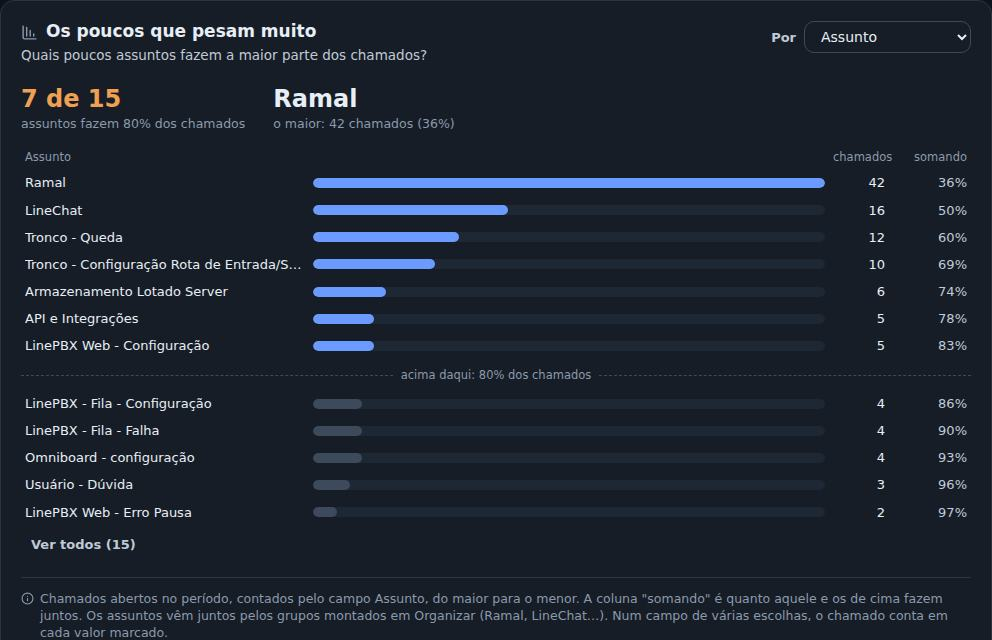

## novo · Previsão da semana
Quantos chamados devem chegar na próxima semana, dia a dia, pela média das últimas 8 semanas, com
o menor e o maior de cada dia. Compara também a semana de agora com o esperado até hoje.
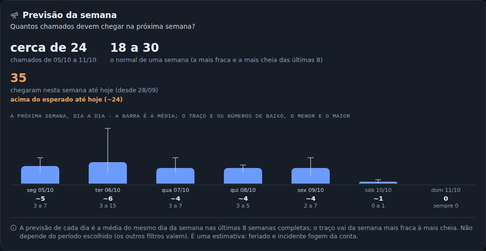

## novo · Chamados pelo tamanho do cliente
Chamados do período divididos pelo tamanho do cliente no Gestor: por 10 DIDs ou por 10 aparelhos.
Um cliente pequeno com muito chamado sobe para o topo. Clique no nome para ver o Raio-X dele.
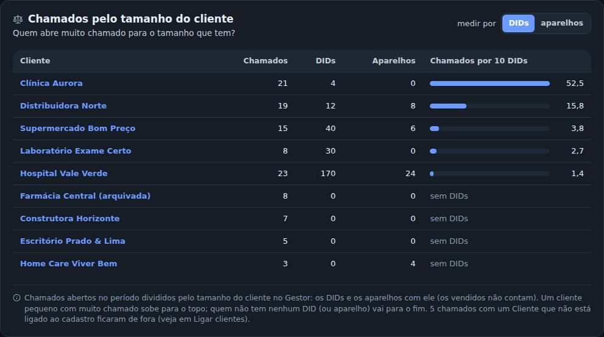

## novo · Voltou com o mesmo problema
Os clientes que abriram o mesmo assunto de novo em até 30 dias, com a linha do tempo de cada
repetição e os chamados. Com os grupos do Assunto montados em Organizar, dá para juntar ("Ramal -
Criação" e "Ramal - Configuração" contam como Ramal).
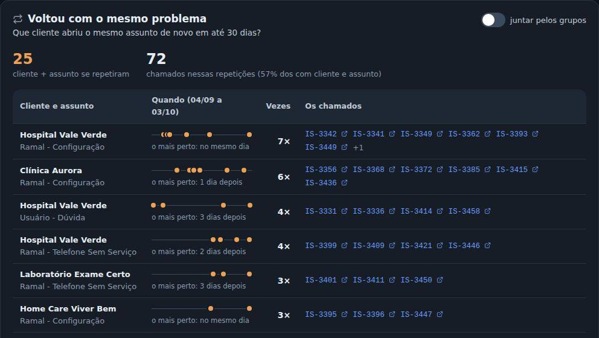

## novo · Raio-X do cliente, e a aba Chamados na ficha
Escolha um cliente e veja tudo do suporte dele: chamados no período, mediana até fechar, o que
está em aberto, quantos voltaram com o mesmo assunto, os assuntos, tipos e produtos, os últimos
chamados — junto com o que ele tem no Gestor (produtos, DIDs, aparelhos). A ficha do cliente tem
a aba Chamados, com o mesmo Raio-X.
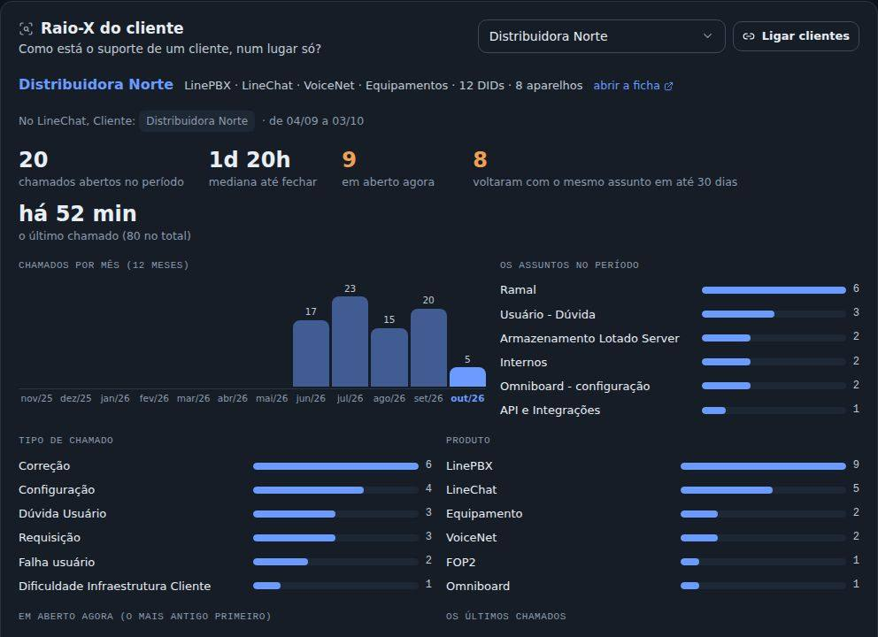

## novo · De quem é a falha?
Os chamados de cada mês em quatro grupos, pelo tipo de chamado: falha nossa, do cliente, da operadora
e pedido ou dúvida. O grupo de cada tipo vem do nome dele; quem administra troca em "Escolher os
grupos".
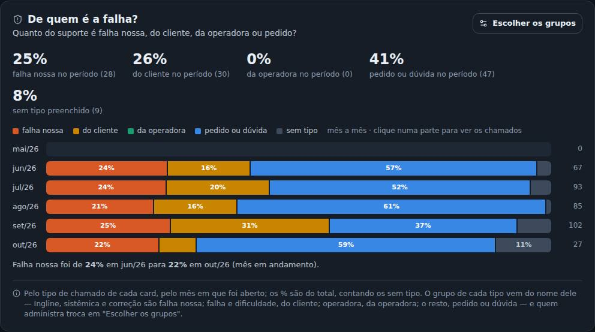

## atencao · Ligar o Cliente do card ao cadastro (quem administra)
No LineChat o Cliente do card é um texto. Quando ele bate com o nome fantasia ou a razão social de
um cliente do Gestor, a ligação é automática. Em Relatórios › Clientes › Ligar clientes, confira
as opções "sem ligação", escolha o cliente certo ou marque "não é cliente do cadastro" (como
Interno). Na mesma janela dá para escolher quais campos do card são o Cliente, o Assunto, o Tipo e
o Produto, e o grupo de cada tipo de chamado. Vale para a equipe toda e fica na auditoria.
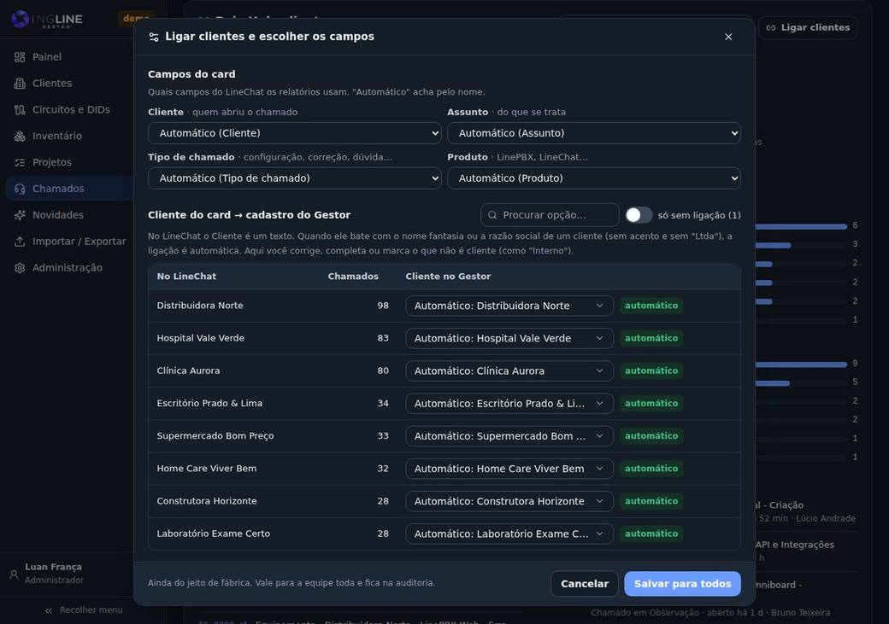

## novo · Quadro da equipe
Por responsável: quantos estão em aberto agora, parados há 7 dias ou mais, vencidos, fechados no
período, a mediana até fechar e uma linha com quantos fechou por semana nas últimas 8 semanas. Em
ordem de nome: é para equilibrar a carga, não para ranquear.
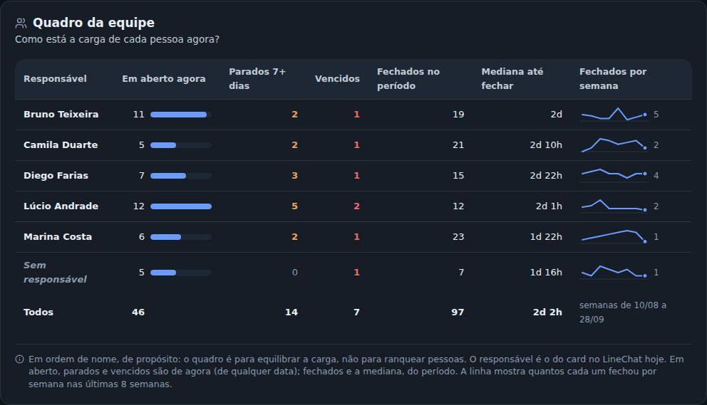

## novo · Card bem preenchido
Dos chamados fechados no período, quantos fecharam com Cliente, Assunto, Tipo, Produto e Resolutor
preenchidos — por campo e por responsável, em ordem de nome. Clique no número de "faltou" para ver
os cards e completar no LineChat. São esses campos que alimentam os outros relatórios.
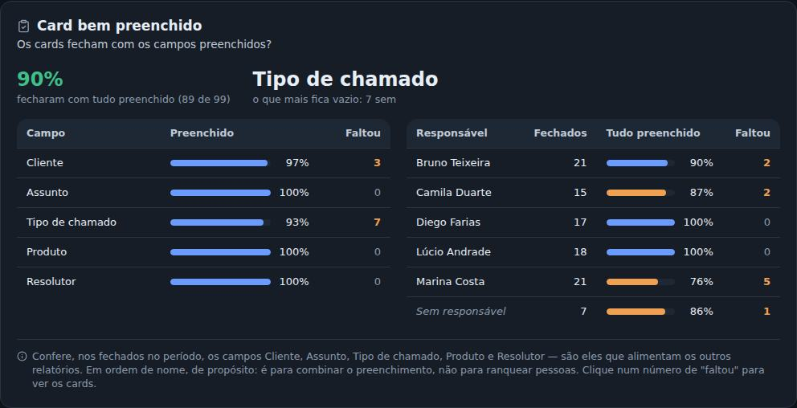

## novo · Fechamento do mês em PDF
Uma página pronta do mês, comparada com o anterior: abertos, fechados, mediana até fechar, fila no
fim do mês, os abertos por dia, os 5 assuntos, os 5 clientes, os tipos e três destaques escritos
sozinhos. O botão "Imprimir ou salvar em PDF" abre a impressão: escolha "Salvar como PDF".
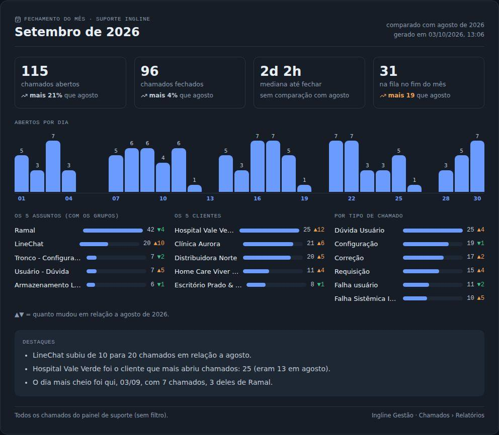

## novo · Envio diário: o PDF dos Chamados no WhatsApp
Todo dia, no horário escolhido, o Gestor monta um PDF com os números do dia e os gráficos e
relatórios marcados, e manda pelo WhatsApp para os números da lista, com uma mensagem com os números
de hoje. Os números são sempre do dia atual, até a hora do envio.
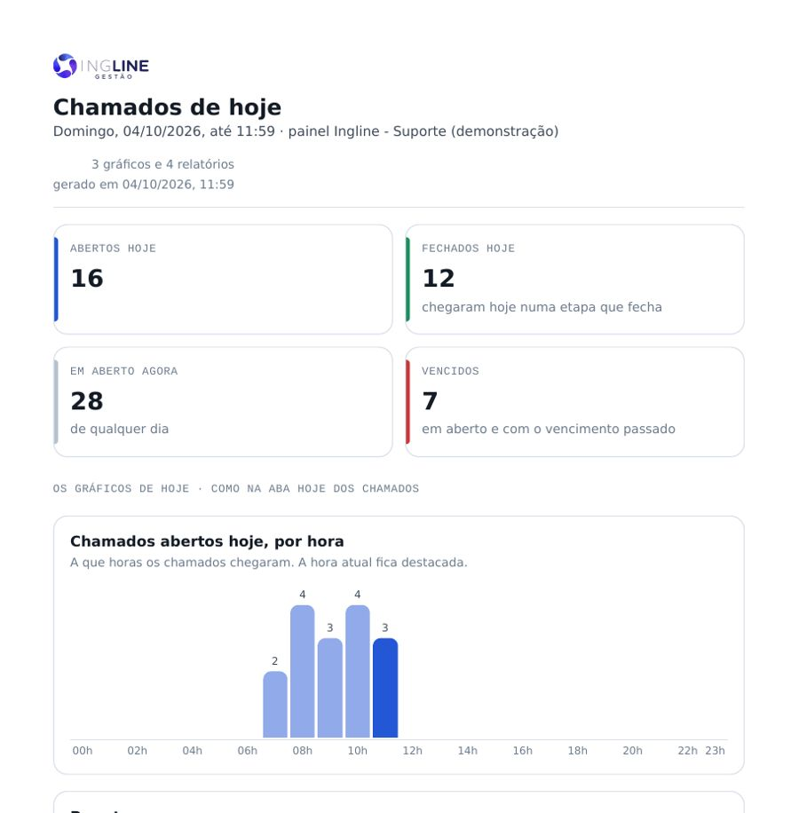

## novo · O aviãozinho do envio diário (quem administra)
Cada gráfico da tela de Chamados e cada relatório (menos o Raio-X) ganhou um aviãozinho discreto no
canto. Clicou, ele fica azul e o item entra no PDF de todo dia; clicou de novo, sai. Vale para a
equipe toda e fica na auditoria. O PDF segue a ordem das telas.
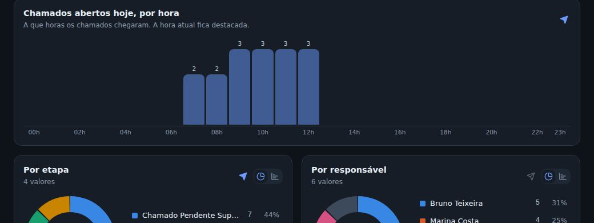

## novo · Administração › Envio automático
Uma aba nova na Administração: ligar e desligar, o horário e os dias, a lista de números (cada um
pode ser pausado), o número que envia, o endereço da API da FlwChat e o token, que vai para o cofre e
nunca aparece de volta. "Testar" manda só uma mensagem de texto; "Mandar agora" manda o PDF de agora;
"Ver como fica" mostra o PDF na tela. Embaixo, o que está marcado e os últimos envios, com o PDF de
cada um. Se o servidor estiver fora do ar no horário, o envio sai quando ele voltar (até 3 horas
depois); se a FlwChat recusar, tenta de novo duas vezes, a cada 15 minutos.
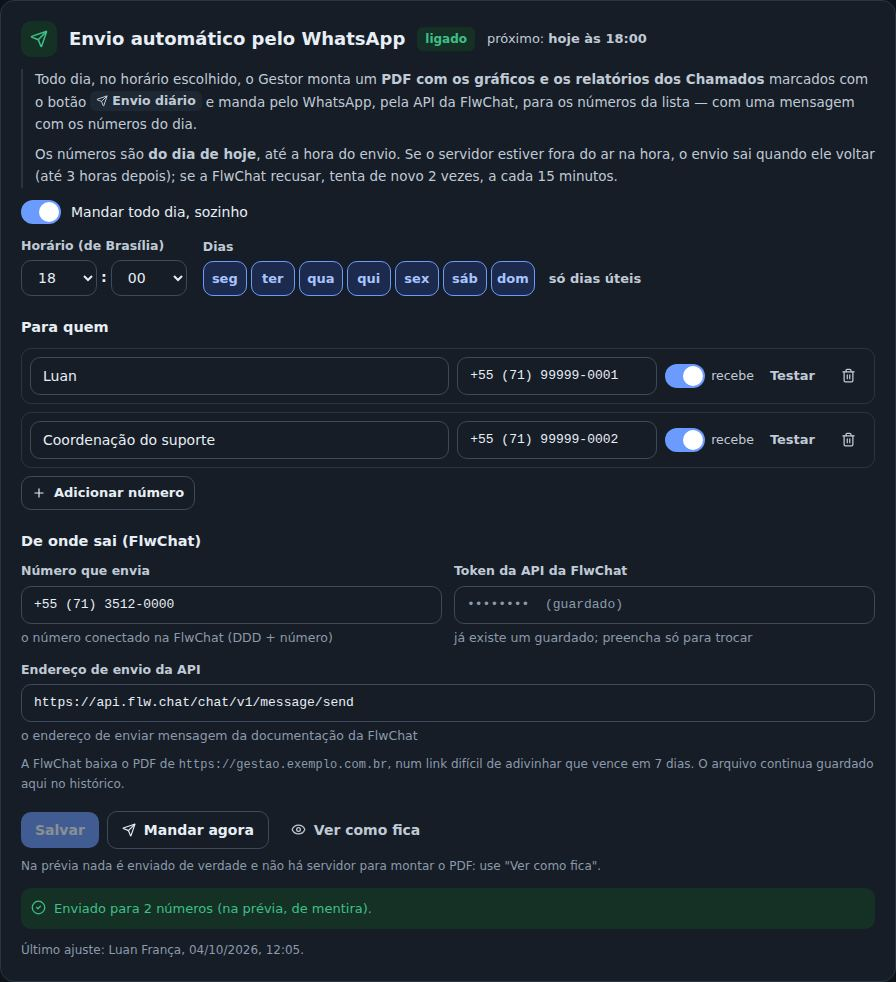
