## atencao · Senha não vai na base de conhecimento
O 1.8 traz a Base de conhecimento, o lugar onde a equipe registra o que aprendeu (os próximos
cartões). Ela é para todo mundo ler, inclusive quem só consulta o sistema. Senha de cliente, de ramal
ou de equipamento continua no lugar dela: na ficha do cliente, que guarda no cofre e registra quem
revelou. No artigo, escreva onde a senha está ("fica na ficha do cliente, aba Acessos"), nunca a
senha.

## novo · Base de conhecimento
No menu, logo abaixo de Chamados. É onde fica o que a equipe aprendeu: o chamado estranho que ninguém
tinha visto, o passo a passo de uma configuração, o cuidado que evita retrabalho. Cada artigo ganha
um código, como BC-12, para colar no card do LineChat ou no WhatsApp. A busca não liga para acento
e procura pelo jeito que o cliente fala ("telefone sem linha", "não me escutam"); as palavras
achadas aparecem em destaque. Os filtros separam por produto, módulo, assunto do LineChat, cliente,
modelo, operadora e autor.
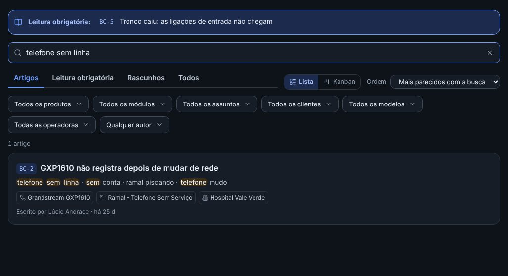

## novo · Lista ou Kanban
O botão Lista | Kanban, ao lado da Ordem, mostra os mesmos artigos de dois jeitos: a lista (o
padrão) ou um quadro com uma coluna por produto, assunto do LineChat, situação ou autor (você escolhe
em Colunas). A busca, as abas e os filtros valem nos dois. O artigo ligado a dois produtos aparece
nas duas colunas. O sistema lembra do jeito que cada um escolheu.
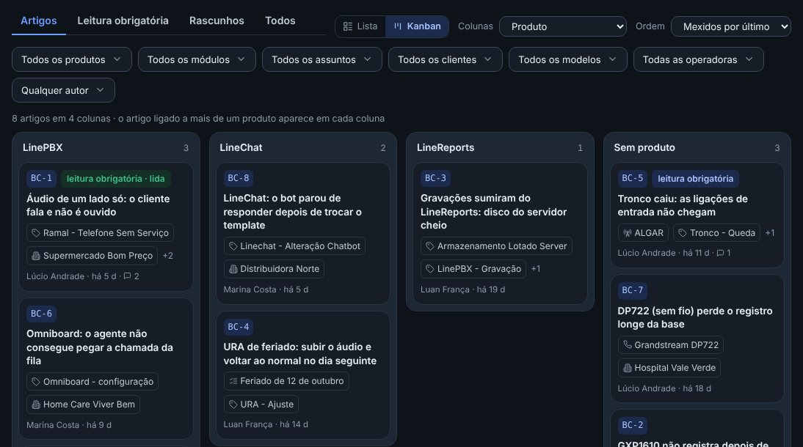

## novo · Um artigo: o que acontece, como resolver, por que acontece
Todo artigo tem as mesmas partes: o que acontece (como o cliente conta), como resolver (os passos),
por que acontece (o que ensina a reconhecer da próxima vez) e as palavras do cliente. Linha que
começa com número vira passo; o comando entre crases ganha o botão Copiar; o print aparece no meio
do passo, e clicar abre a imagem inteira. Escrever BC-1 no texto vira link para o outro artigo.
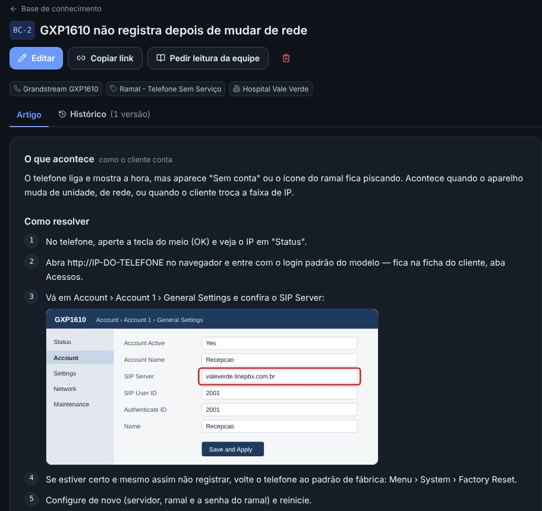

## novo · Escrever é rápido
Os botões Passo e Comando escrevem o começo da linha para você, e o print entra colando a imagem no
texto (Ctrl+V): o sistema reduz o tamanho sozinho. "Ver como fica" mostra o artigo pronto antes de
publicar. Planilha, PDF ou configuração exportada vão em Anexos, até 10 MB cada. Para publicar, só
o título e o "Como resolver" são obrigatórios; antes disso, dá para salvar como rascunho, que só
você (e quem administra) vê.
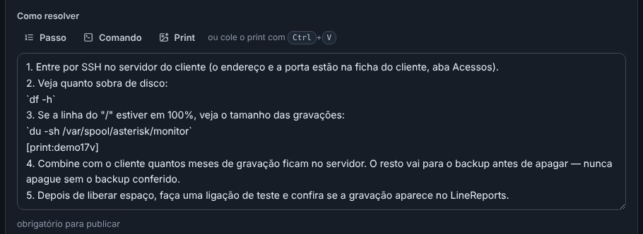

## novo · Registrar a partir do chamado
Digite o código do card (IS-3607) em "Veio de um chamado?" e o título, a descrição e as ligações
(cliente, assunto, produto e o próprio chamado) vêm preenchidos — é só escrever como resolveu. O
Gestor só lê o card: nada muda no LineChat.
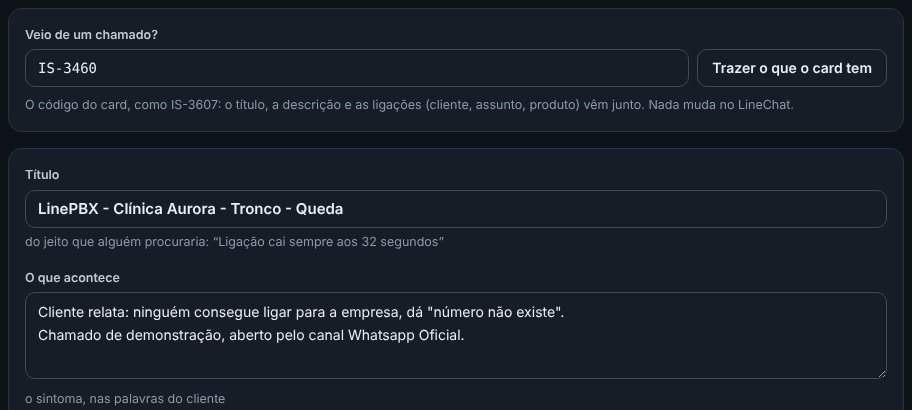

## novo · O livrinho na tabela de Chamados
Ao lado do código do card aparece um livrinho com o número de artigos que valem para aquele chamado:
os ligados ao próprio card, ao assunto dele e ao cliente dele. Clique para ver quais. Passando o
mouse na linha aparece o botão de registrar na base a partir daquele chamado. O mesmo vale na janela
de chamados dos Relatórios.
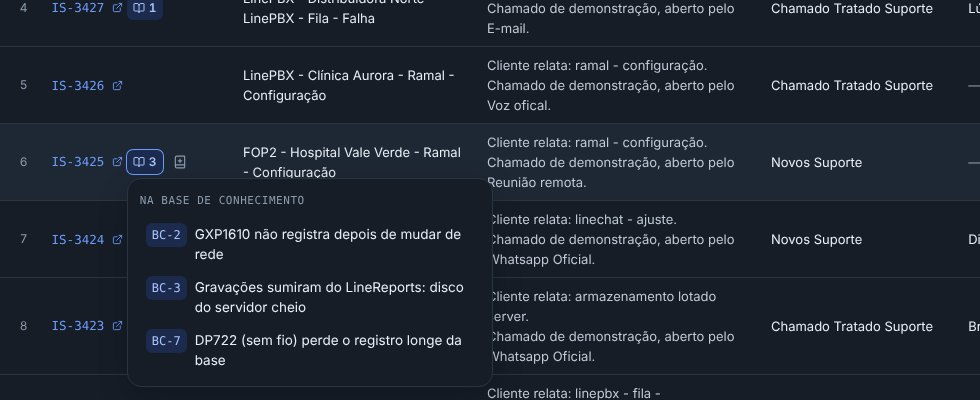

## novo · A base aparece onde você está
A ficha do cliente mostra "3 artigos sobre este cliente"; o pop-up do modelo, os artigos sobre
aquele aparelho; a ficha do circuito, os artigos sobre a operadora dele. Sem artigo nenhum, nada
aparece. É pelas ligações que o artigo chega lá: no formulário, em "Onde acontece".
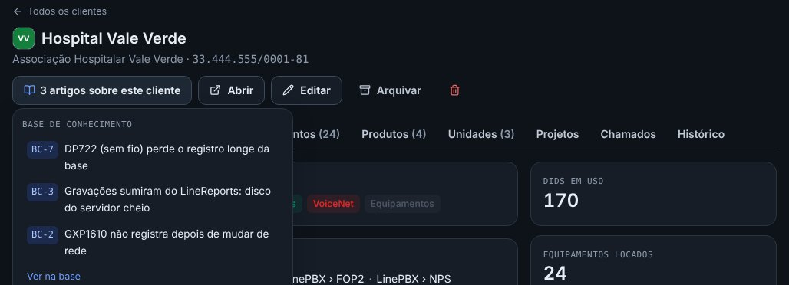

## novo · Como fazer, na ficha do projeto
O projeto mostra os artigos ligados a ele — o passo a passo que a equipe segue em cada cliente.
"Ligar um artigo" traz um que já existe; "Registrar o que aprendemos" abre um artigo novo já ligado
ao projeto. Com o projeto encerrado, esse botão fica em destaque.
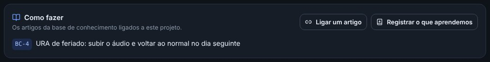

## novo · Qualquer um melhora, e nada se perde
Quem escreve pode melhorar o artigo de qualquer pessoa. Cada mudança no texto vira uma versão: o
Histórico mostra quem mudou, quando, e o que saiu e o que entrou. "Voltar a esta versão" traz o texto
antigo de volta como uma versão nova, sem apagar as do meio. Se duas pessoas editam o mesmo artigo
ao mesmo tempo, quem salvar por último recebe um aviso em vez de apagar o que a outra escreveu.
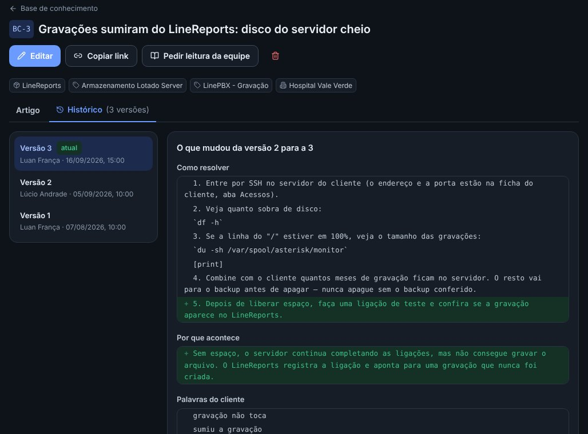

## novo · Comentários no artigo
Embaixo de cada artigo, quem escreve na base pode comentar o que viu depois: "aconteceu de novo no
cliente X", "no Mikrotik a opção fica em outro lugar". Fica registrado quem comentou e quando, sem
mexer no texto (corrigir o passo a passo continua sendo o Editar, que guarda a versão). A lista
mostra quantos comentários cada artigo tem. Cada um apaga o próprio comentário (quem administra
apaga qualquer um), e a auditoria guarda o texto apagado.
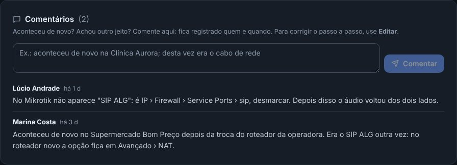

## novo · Leitura obrigatória (quem administra)
Ao escrever um artigo importante, marque "Pedir a leitura da equipe" no próprio formulário: ao
publicar, ele aparece em destaque na base e com um número no menu de cada pessoa, até ela marcar
"Li e entendi" (dá também pelo botão do artigo, depois). Quem administra vê quantos já leram e quem
falta. Se o artigo mudar, "Pedir a leitura de novo" — ao salvar a mudança ou no artigo — pede para
todo mundo ler outra vez.
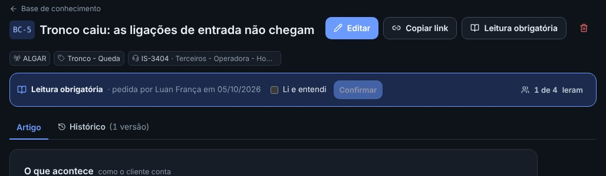
