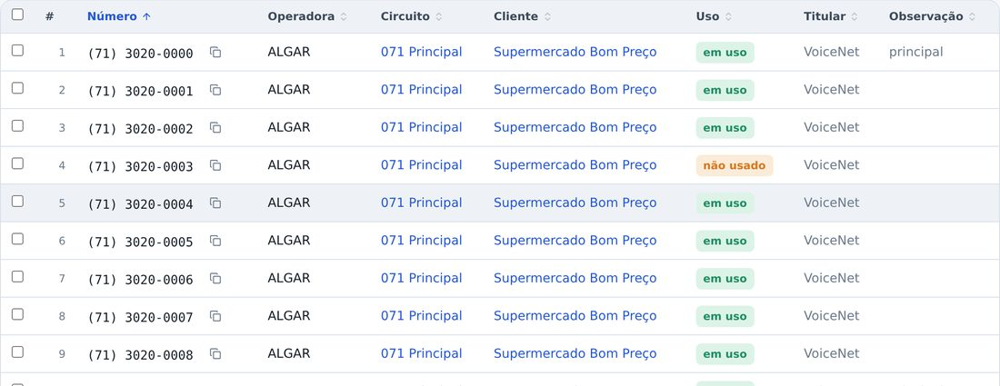
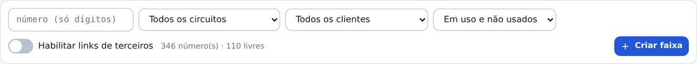
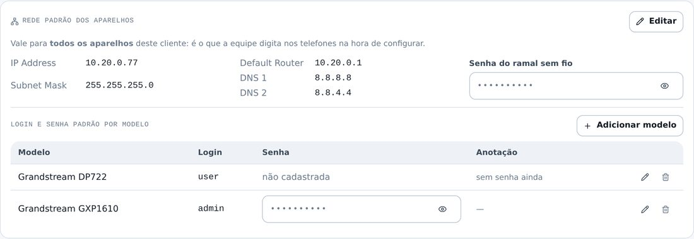
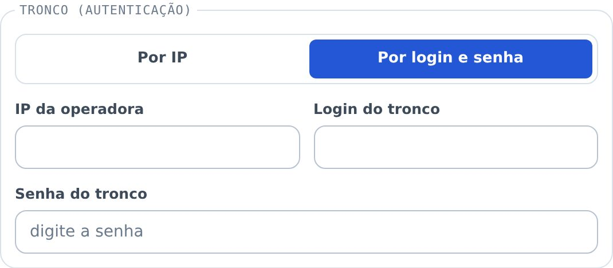
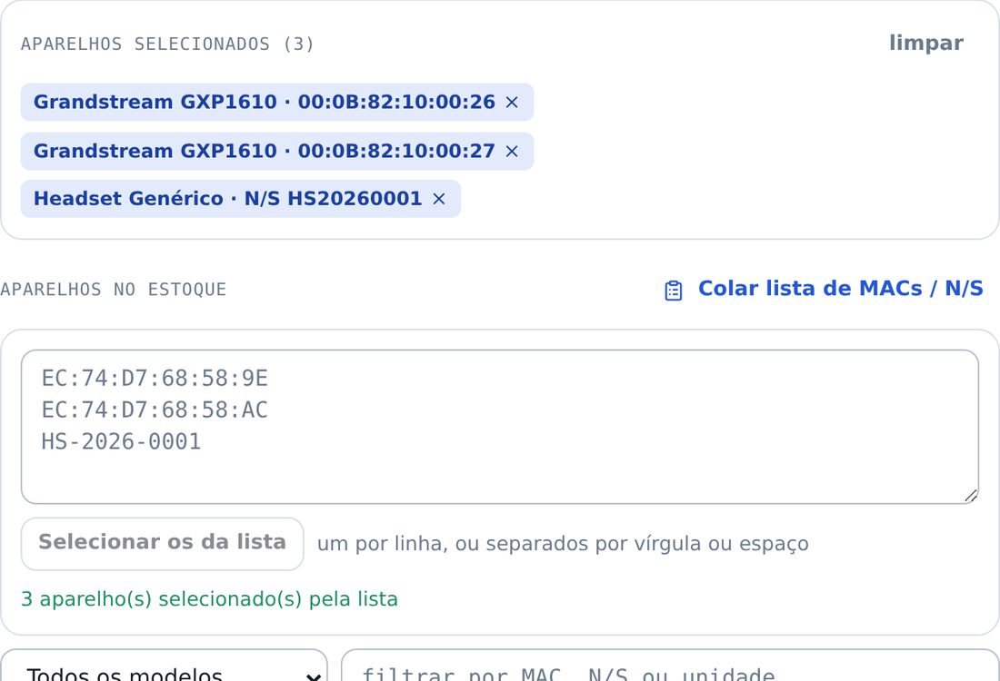
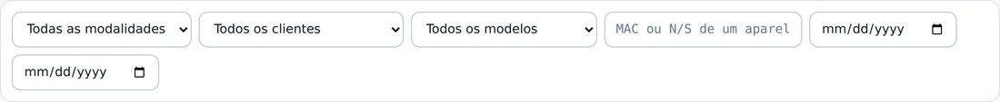
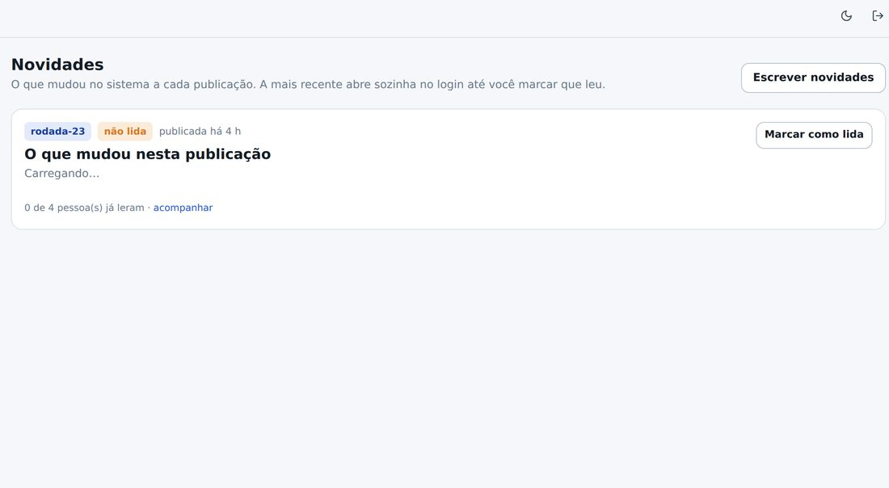

## atencao · Todo número agora nasce dentro de um circuito
Acabou o "sem circuito". Ao criar uma faixa de DIDs, escolher o circuito passou a ser obrigatório,
e mudar de circuito em massa também exige dizer para qual. Os cartões do topo agora mostram
**DIDs livres** no lugar de "DIDs sem circuito".

## atencao · Cada número diz se está em uso ou só alocado
Alocar não é usar: quando um número vai para um cliente, ele entra como **não usado** — alguém
marca **em uso** quando ele passa a atender de verdade. Basta clicar na marca para trocar.
Liberar o número, ou passá-lo para outro cliente, derruba a marca.

## novo · Filtro de uso na Numeração
Dá para ver só os que estão em uso, só os que ainda não estão, ou marcar vários de uma vez
pela barra de seleção. A marca aparece também na ficha do cliente e na ficha do circuito.

## novo · Rede padrão e login dos aparelhos, por modelo
Na aba **Equipamentos** do cliente: IP, máscara, roteador padrão, DNS e a senha do ramal sem fio
— o que a equipe digita no telefone na hora de configurar. Abaixo, o **login e a senha padrão de
cada modelo**: todos os GXP1610 daquele cliente usam um; os DP722, outro. A senha fica no cofre.

## novo · Tronco por IP ou por login e senha
No cadastro do circuito você escolhe como o tronco se autentica na operadora. Por **IP**: o IP da
operadora e o IP do PBX. Por **login e senha**: o login do tronco e a senha, guardada no cofre.
O que não pertence ao tipo escolhido some do formulário.

## novo · Unidades com endereço e IP fixo de saída
Cada unidade do cliente (Matriz, filial, loja) agora guarda o endereço e o IP fixo de saída da
rede dela — o IP que chega ao servidor quando os ramais daquela unidade registram.

## melhorou · Movimentar colando a lista de MACs
No "Movimentar aparelhos", o botão **Colar lista de MACs / N/S** aceita a lista inteira de uma vez.
O que existe no estoque entra na seleção; o que não existe aparece listado, sem barrar o resto.

## melhorou · Movimentações por modelo e por aparelho
O histórico de movimentações ganhou filtro por **modelo** e busca por **MAC ou N/S** — dá para
ver a vida inteira de um aparelho, na ordem em que ela aconteceu.

## melhorou · Renomear item de catálogo
Operadora, hospedagem e categoria de aparelho agora podem ser renomeadas pelo lápis ao lado do
nome, em Administração › Catálogos. O nome novo vale em todo lugar que usa o item.

## melhorou · A lista de clientes vem inteira
Sem páginas: todos os clientes de uma vez, como você pediu.

## novo · Estas novidades ficam guardadas aqui
Toda publicação passa a ter uma nota como esta. Ela abre uma vez no seu login e só para de
abrir quando você marca "Li e entendi". O menu **Novidades** guarda o histórico para reler.

## corrigido · A anotação do tronco não se preenche mais sozinha
A palavra "address" que às vezes aparecia sozinha na anotação do circuito era o preenchimento
automático do navegador, não o sistema. Os campos foram marcados para o navegador não chutar.
